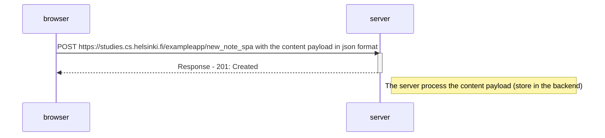

```mermaid
sequenceDiagram
    participant browser
    participant server

    browser->>server: POST https://studies.cs.helsinki.fi/exampleapp/new_note_spa with the content payload in json format
    activate server    
    server-->>browser: Response - 201: Created
    deactivate server
    Note right of server: The server process the content payload (store in the backend)
```

